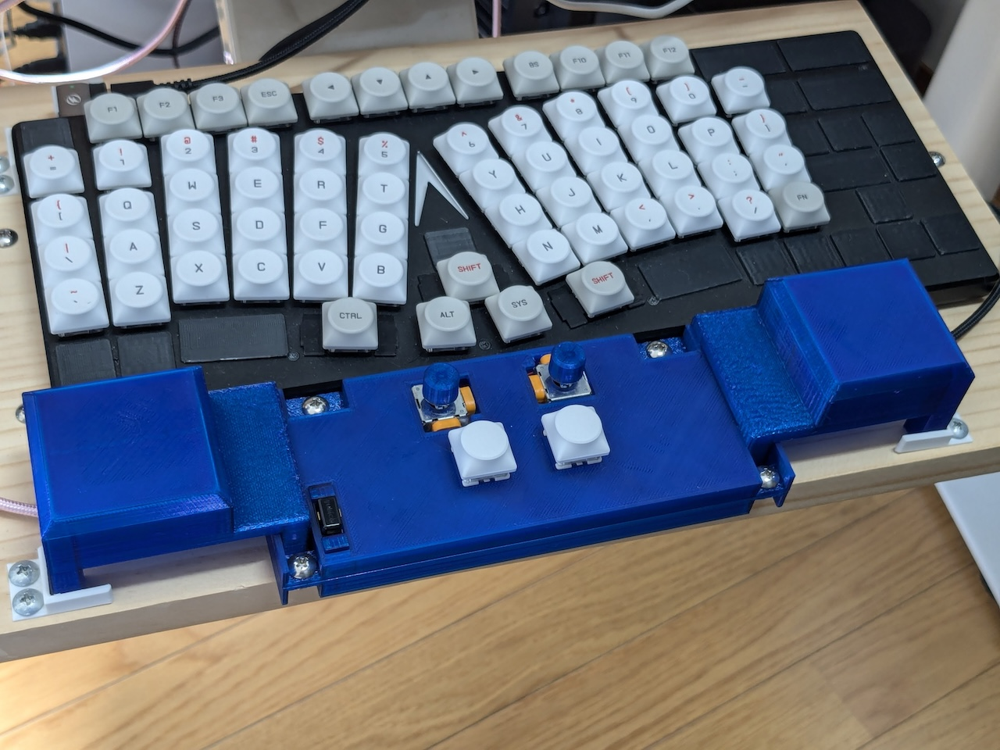
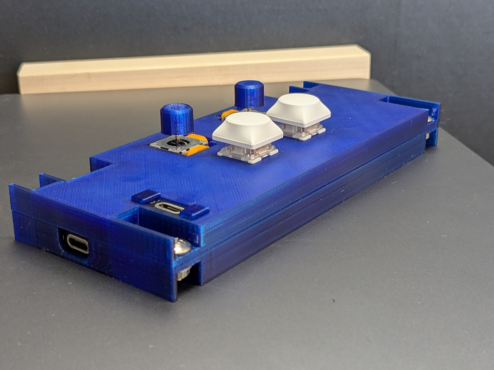

# ComboStick: A mouse that combines and operates two sticks simultaneously

This is a joystick-operated mouse designed to keep your hands on the keyboard.
It’s made by modifying a commercially available Logitech F310 Gamepad, which can be obtained at a low cost.
The exterior can be produced with a 3D printer.

As it is, it’s recognized as a joystick, so it needs to be used with Karabiner-Elements on macOS to work as a mouse.

The power of Karabiner-Elements, this setup has the following features, offering advantages that other pointing devices don’t have.

-   The left stick controls pointer movement, while the right stick handles scrolling, allowing both actions to be performed with the same tilting motion.
-   When using one stick for cursor movement or scrolling, it allows for slow and precise control.
    Tilting the second stick while doing so adds additional speed, enabling a wide range of actions from delicate adjustments to large movements with ease.
-   As long as the stick is tilted, it continues to provide input. This is a major advantage when scrolling infinitely or moving across a large screen in any direction.

| Using with keyboard        | ComboStick                           |
| -------------------------- | ------------------------------------ |
|  |  |
