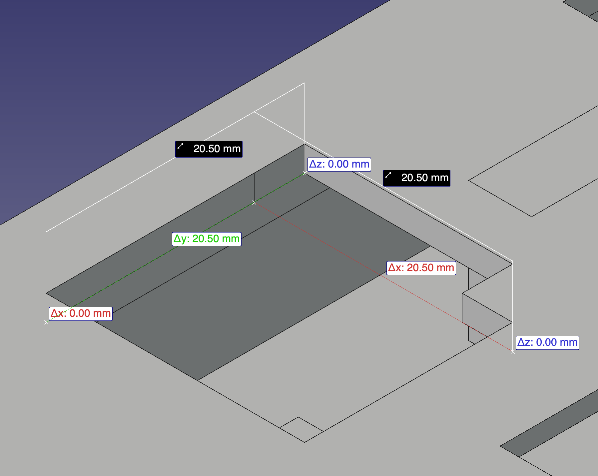
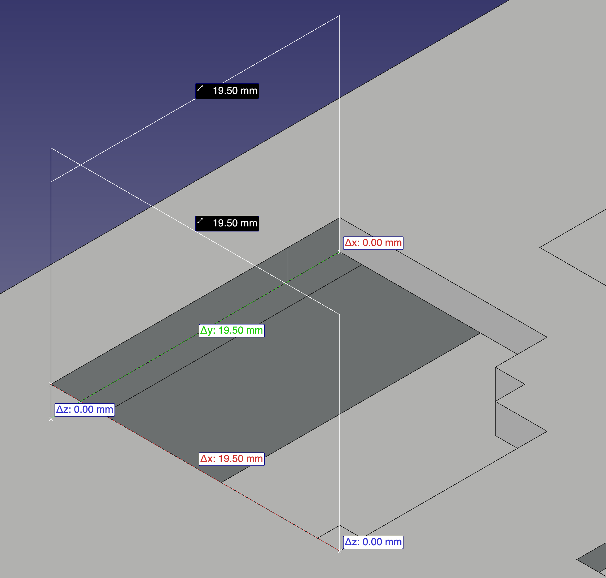

# Changelog

## ComboStick-v2

- Tightened the clearance around the joystick hole in the upper case to help prevent the PCB from shifting during joystick operation.

| Old (ComboStick-v1)       | New (ComboStick-v2)       |
| ------------------------- | ------------------------- |
|  |  |

## ComboStick-v1

- Initial release.
